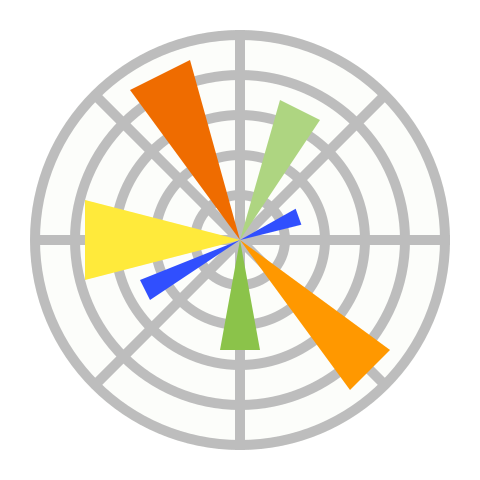

# Operação Curto Circuito CDT13

# Projeto 06 — Operação Curto-Circuito: Furto de Energia + Apagão

> **Equipe :** Dalton Linconl, José Ricardo Teixeira, João Pinheiro
> **Disciplina:** Programação para Ciência de Dados
> **Curso:** MBA em Ciência de Dados — UNIFOR
> **Professor:** Cássio Pinheiro
> **Descrição:** Neste projeto, foi realizada uma análise de dados para investigar o aumento de furtos de energia (perdas não técnicas) e quedas de energia em bairros da capital cearense. Foram analisados dados de 5.000 unidades consumidoras, registros de ocorrências na rede elétrica e informações sobre transformadores.

---

## Briefing da Operação

Uma concessionária de energia elétrica do Ceará está enfrentando **perdas não-técnicas crescentes** (furto de energia) e um **aumento de ocorrências de queda de energia** concentrado em um bairro específico. A engenharia suspeita que os dois problemas estão conectados: o furto estaria sobrecarregando a infraestrutura local, causando os apagões.

Você recebeu dados de consumo de 5.000 unidades consumidoras, registro de ocorrências na rede e o cadastro de transformadores. Descubra onde está o problema.

---

## Principais descobertas

Confirmou a hipótese inicial da engenharia: o bairro Barra do Ceará concentra o principal problema da rede, tendo o transformador T-023 como ponto crítico. O evento registrado em julho de 2024, no qual 51 unidades consumidoras foram afetadas simultaneamente, sugere a ocorrência de furto de energia de forma organizada, contribuindo diretamente para a sobrecarga do transformador e para os apagões recorrentes na região.

Entretanto, o problema não pode ser explicado apenas por essa causa. Uma hipótese complementar é que a infraestrutura elétrica do bairro não acompanhou o crescimento urbano, fazendo com que a rede opere próxima ou acima de sua capacidade. Assim, os apagões podem resultar da combinação entre furtos de energia e limitações estruturais da rede.

Diante desse cenário, a solução exige duas frentes de atuação: ações de fiscalização para identificar e combater irregularidades e investimentos na expansão da infraestrutura elétrica, com instalação de novos transformadores e melhor planejamento da distribuição de carga no bairro.

---

## Como executar

### 1. Clonar o repositório

```bash
git clone git@github.com:rcardoo/Operacao-Curto-Circuito-CDT13.git
```

### 2. Acessar a pasta do projeto

```bash
cd Operacao-Curto-Circuito-CDT13
```

### 3. Instalar as dependências

```bash
pip install numpy pandas matplotlib
```

---

## Datasets Fornecidos

### 1. `data/projeto_06_consumo_energia.csv`

Consumo mensal de 5.000 unidades consumidoras (2023-2024).

| Coluna                | Descrição                                   |
| --------------------- | ------------------------------------------- |
| `uc_id`               | Identificador da unidade consumidora        |
| `classe`              | Classe (Residencial, Comercial, Industrial) |
| `bairro`              | Bairro                                      |
| `ano`                 | Ano                                         |
| `mes`                 | Mês                                         |
| `consumo_kwh`         | Consumo mensal (kWh)                        |
| `temperatura_media_c` | Temperatura média do mês (°C)               |

### 2. `data/projeto_06_ocorrencias_rede.csv`

Registro de ocorrências na rede elétrica.

| Coluna             | Descrição                                                       |
| ------------------ | --------------------------------------------------------------- |
| `ocorrencia_id`    | Identificador da ocorrência                                     |
| `data_ocorrencia`  | Data da ocorrência                                              |
| `bairro`           | Bairro afetado                                                  |
| `tipo_ocorrencia`  | Tipo (Queda de energia, Flutuação, Curto-circuito, Furto, etc.) |
| `transformador_id` | Transformador associado                                         |
| `duracao_horas`    | Duração da interrupção (horas)                                  |
| `ucs_afetadas`     | Número de UCs afetadas                                          |
| `causa_provavel`   | Causa provável (Sobrecarga, Falha, Clima, etc.)                 |

### 3. `data/projeto_06_cadastro_transformadores.csv`

Cadastro dos 50 transformadores da concessionária.

| Coluna              | Descrição                 |
| ------------------- | ------------------------- |
| `transformador_id`  | Identificador             |
| `bairro`            | Bairro                    |
| `capacidade_kva`    | Capacidade (kVA)          |
| `ucs_conectadas`    | Número de UCs conectadas  |
| `ano_instalacao`    | Ano de instalação         |
| `ultima_manutencao` | Data da última manutenção |
| `status`            | Status operacional        |

---

## Missão

Investigue os dados e responda:

1. **Quais unidades consumidoras apresentam queda abrupta de consumo?** Identifique UCs cujo consumo caiu 80-90% de um mês para o outro. Quando isso aconteceu e em qual bairro?
2. **As UCs com queda abrupta estão concentradas geograficamente?** Há um bairro que concentra essas anomalias?
3. **Existe correlação entre as anomalias de consumo e o aumento de ocorrências na rede?** Cruze os dois datasets por bairro e período.
4. **Qual transformador está sobrecarregado?** Identifique transformadores com número de UCs conectadas muito acima de sua capacidade.
5. **O surto de ocorrências está ligado à sobrecarga?** O transformador sobrecarregado é o mesmo associado às ocorrências frequentes?
6. **Estime o prejuízo** da concessionária com o furto: quanto de energia está sendo "desviada" por mês?

## Estrutura do Projeto

```
Operacao-Curto-Circuito-CDT13/
├── README.md          ← Este arquivo
├── assets/            ← Imagens utilizadas
├── data/              ← Datasets do projeto
├── notebooks/         ← Notebook(s) Jupyter com a investigação
└── docs/              ← Documentação adicional, apresentação
```

---

## Tecnologias utilizadas

Python, Pandas, Numpy, Matplotlib



